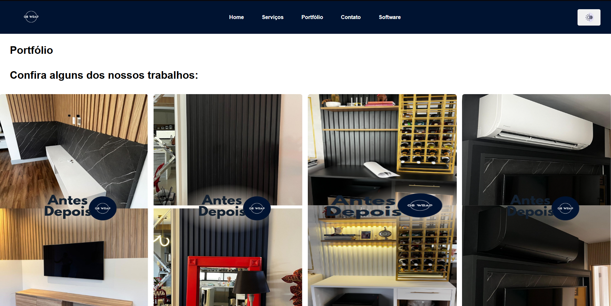
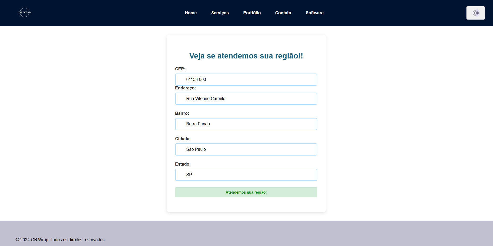
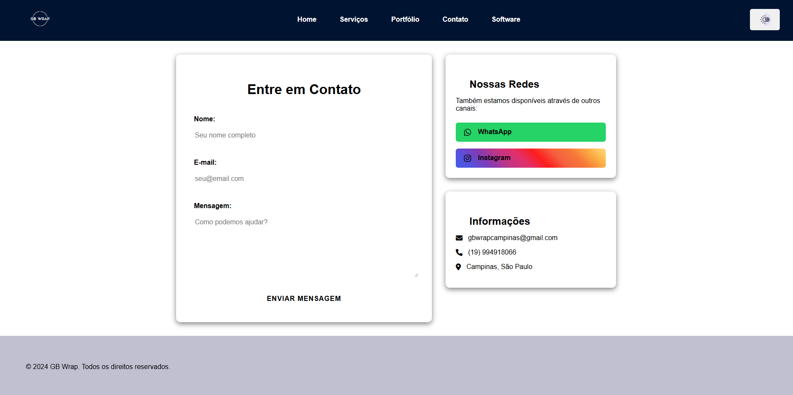
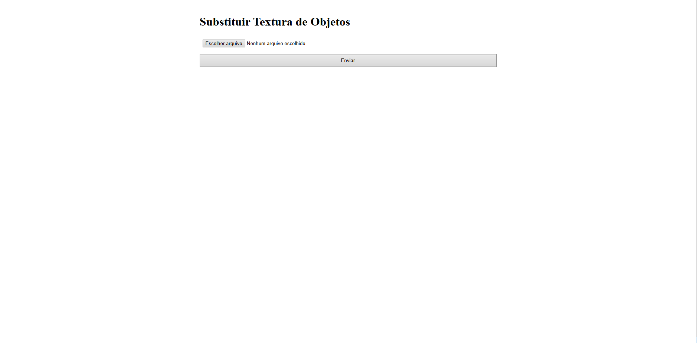
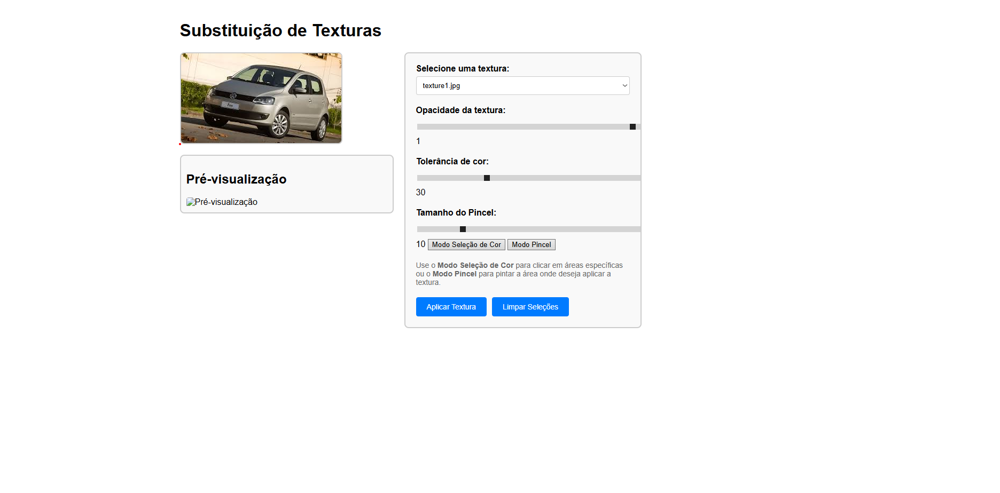
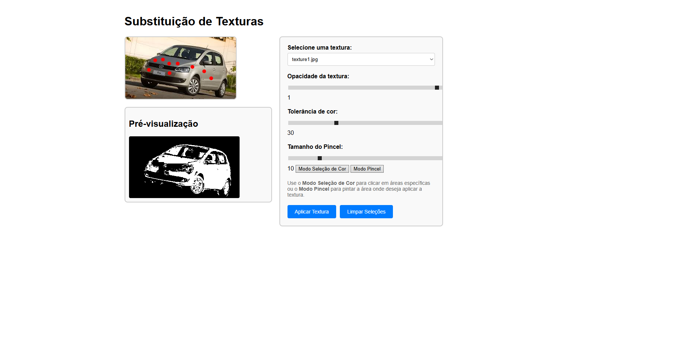
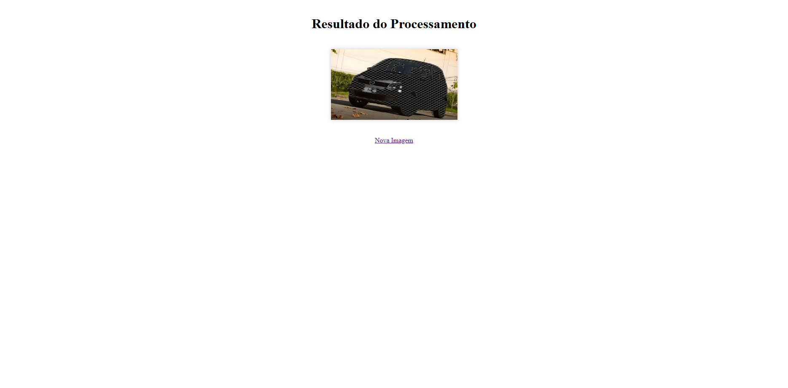

# Bem-vindo ao site oficial da **GB Envelopamentos**  

Especializado em envelopamento decorativo, a **GB Envelopamentos** transforma ambientes com estilo e praticidade.  

## 🔹 Sobre o Site  
Nosso site foi desenvolvido para apresentar nosso portfólio de serviços, facilitar o contato com clientes e permitir a verificação rápida de atendimento por região, através do CEP.  

## 🛠️ Funcionalidades  
- 📸 **Portfólio** – Veja exemplos reais dos nossos projetos de envelopamento decorativo.

- 📍 **Verificação de Atendimento** – Informe seu CEP e descubra se atendemos sua região.
  
- 📩 **Fale Conosco** – Entre em contato diretamente pelo site para orçamentos e dúvidas.  

- **Em desenvolvimento**: Em breve, será disponibilizado um software que permitirá visualizar o resultado de um envelopamento decorativo antes da aplicação. Com ele, será possível fazer o upload de uma imagem (como uma
 parede, móvel ou carro) e testar diferentes cores e texturas, facilitando a escolha do design ideal.  

## 🚀 Tecnologias Utilizadas 
- **Frontend:** HTML, CSS, JavaScript  
- **Backend:** Python (em desenvolvimento)  
- **Integrações:** Verificação de CEP e envio de e-mails  
